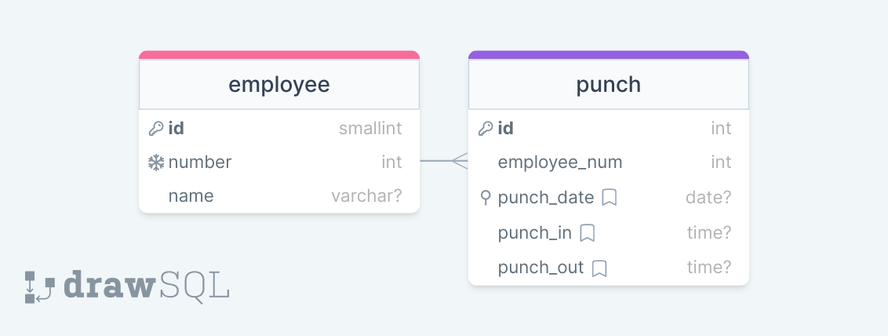

# KDAN_HW
## 專案部署方式
* table資料裡面有table.sql與backup.sql。
* load.js為將member.json讀取到db的程式(需要先將table建好，可參考table.sql)
* db使用mysql，可以使用backup.sql來重建資料庫
* 可使用node app.js或docker compose up -d 來啟動程式


<br>

## 部署的部分
目前有將程式部署在AWS的EC2，DB則使用RDS  
http://54.95.187.205:3000/api/1.0/  
 

## API文件

### API Version
1.0
### 打卡 API
* **End Point:** `/punch`

* **Method:** `POST`

* **Request Body**

| Field | Type | Description |
| :---: | :---: | :--- |
| employeeNum | Integer | 員工編號 |

* **Request Example:**
  `http://[HOST_NAME]/api/[API_VERSION]/punch`
  ```
  {
    "employeeNum": 1110001
  }
  ```

* **Success Response: 200**

| Field | Type | Description |
| :---: | :---: | :--- |
| message | String | 打卡狀態 |

* **Response Example:**
  ```
  {
    "message": "成功打上班卡"
  }
  ```
  or
  ```
  {
    "message": "成功打下班卡"
  }
  ```
  or
  ```
  {
    "message": "已經打過卡"
  }
  ```

* **Server Error Response: 500**

| Field | Type | Description |
| :---: | :---: | :--- |
| error | String | Error message. |

### 補打卡 API
* **End Point:** `/punch`

* **Method:** `PUT`

* **Request Body**

| Field | Type | Description |
| :---: | :---: | :--- |
| employeeNum | Integer | 員工編號 |
| date | String | 補打卡日期 |
| isPunchIn | Integer (0,1) | 1為in, 0為out |
| time | String | 補打卡時間 |

* **Request Example:**
  `http://[HOST_NAME]/api/[API_VERSION]/punch`
  ```
  {
    "employeeNum": 1110001,
    "date": "2023-01-16",
    "isPunchIn": 1,
    "time": "16:30:30"
  }
  ```

* **Success Response: 200**

| Field | Type | Description |
| :---: | :---: | :--- |
| message | String | 打卡狀態 |

* **Response Example:**
  ```
  {
    "message": "補打卡成功"
  }
  ```

* **Server Error Response: 500**

| Field | Type | Description |
| :---: | :---: | :--- |
| error | String | Error message. |

### 所有員工當日資訊 API
* **End Point:** `/list`

* **Method:** `GET`

* **Request Body**
  無
* **Request Example:**
  `http://[HOST_NAME]/api/[API_VERSION]/list`

* **Success Response: 200**

| Field | Type | Description |
| :---: | :---: | :--- |
| data | Array | Array of attendance object|

* `Attendance Object`

| Field | Type | Description |
| :---: | :---: | :--- |
| employeeNum | Integer |  員工編號 |
| punchIn | String | 上班時間 |
| punchOut | String | 下班時間 |
| restTime | Integer | 休息時間 |
| workTime | Integer | 總工時 |

若punch in或punch out為null，休息時間與總工時也為null
* **Response Example:**
  ```
  {
    "data": [
        {
            "employeeNum": 1110001,
            "punchIn": null,
            "punchOut": "08:33:00",
            "restTime": null,
            "workTime": null
        },
        {
            "employeeNum": 1110003,
            "punchIn": "08:00:00",
            "punchOut": "17:33:00",
            "restTime": 1.5,
            "workTime": 8.05
        }
      ]
  }
  ```

* **Server Error Response: 500**

| Field | Type | Description |
| :---: | :---: | :--- |
| error | String | Error message. |


### 指定日期所有員工資訊 API
* **End Point:** `/list`

* **Method:** `GET`

* **Request Body**

| Field | Type | Description |
| :---: | :---: | :--- |
| date | String | 指定日期 |

* **Request Example:**
  `http://[HOST_NAME]/api/[API_VERSION]/list`
  ```
    {
      "date": "2022-01-03"
    }
  ```
* **Success Response: 200**

| Field | Type | Description |
| :---: | :---: | :--- |
| data | Array | Array of attendance object|

* `Attendance Object`

| Field | Type | Description |
| :---: | :---: | :--- |
| employeeNum | Integer |  員工編號 |
| punchIn | String | 上班時間 |
| punchOut | String | 下班時間 |
| restTime | Integer | 休息時間 |
| workTime | Integer | 總工時 |

若punch in或punch out為null，休息時間與總工時也為null
* **Response Example:**
  ```
  {
    "data": [
        {
            "employeeNum": 1110001,
            "punchIn": null,
            "punchOut": "08:33:00",
            "restTime": null,
            "workTime": null
        },
        {
            "employeeNum": 1110003,
            "punchIn": "08:00:00",
            "punchOut": "17:33:00",
            "restTime": 1.5,
            "workTime": 8.05
        }
      ]
  }
  ```

* **Server Error Response: 500**

| Field | Type | Description |
| :---: | :---: | :--- |
| error | String | Error message. |


### 未打下班卡 API
* **End Point:** `/absence`

* **Method:** `GET`

* **Request Body**

| Field | Type | Description |
| :---: | :---: | :--- |
| from | String | 開始時間 |
| to | String | 結束時間 |

* **Request Example:**
  `http://[HOST_NAME]/api/[API_VERSION]/absence`
  ```
  {
    "from": "2022-01-02",
    "to": "2023-01-16"
  }
  ```

* **Success Response: 200**

| Field | Type | Description |
| :---: | :---: | :--- |
| data | Array | Array of employee number |

* **Response Example:**
  ```
  {
    "data": [
        1110010,
        1110011,
        1110012
    ]
  }
  ```

* **Server Error Response: 500**

| Field | Type | Description |
| :---: | :---: | :--- |
| error | String | Error message. |


### 最早打卡上班 API
* **End Point:** `/early`

* **Method:** `GET`

* **Request Body**
 
| Field | Type | Description |
| :---: | :---: | :--- |
| date | String | 指定日期 |

* **Request Example:**
  `http://[HOST_NAME]/api/[API_VERSION]/early`
  ```
  {
    "date": "2022-01-03"
  }
  ```

* **Success Response: 200**

| Field | Type | Description |
| :---: | :---: | :--- |
| data | Array | Array of employee number |

* **Response Example:**
  ```
  {
    "data": [
        1110003,
        1110019,
        1110018,
        1110020,
        1110016
    ]
  }
  ```

* **Server Error Response: 500**

| Field | Type | Description |
| :---: | :---: | :--- |
| error | String | Error message. |